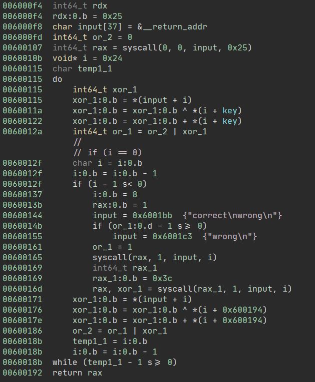

# Categories 

+  [Rev](#rev)

## Rev

### Reverse-ing

**Solved By:** not-matthias  
**Points:** 114  
**Flag:** TSGCTF{S0r3d3m0_b1n4ry_w4_M4wa77e1ru}

##### Challenge

This is what we call "Reversing."

##### Solution

The first thing I do after downloading the binary, is to check the binary architecture, target operating system and whether it has debug symbols.

```bash
$ file reversing 
reversing: ELF 64-bit LSB executable, x86-64, version 1 (SYSV), statically linked, not stripped
```

Alright, we know that it's a linux executable, so let's open it in IDA. We can see that the first few instructions look normal but everything after `call rbx` is basically trash and makes no sense. 


The reverse basically modifies the function `_start` and when we return from the `_reverse` function, we basically execute the deobfuscated code. 


I first just copied the bytes and wrote a little python script to reverse the instructions, but that was really complicated and made the task a lot harder. When @jeff_ mentioned that the `reverse` function is called a lot, I decided to take a different approach. I start at the address of the `_start` function and go through the code and check if there's the `jmp rbx` opcode. Because we know that we executed the previous code until this jump, we can save it to our output image. When we call the reverse function, all the previous executed code will also be scrambled again, so this step is really important. 

```python
file = open('reversing', 'rb')
output = open('reversing_deobfuscated', 'wb')

original = file.read()
content = bytearray(original)
patched = bytearray(original)

SHELLCODE = 0x1BA
START = 0xE5

JMP_RBX_OPCODE = [0xFF, 0xD3]

def save(from_offset, to_offset):
    for i in range(from_offset, to_offset):
        patched[i] = content[i]

def reverse():
    #   for ( index = 106LL; index >= 0; --index )
    #   {
    #     opcode = *(shellcode - index);
    #     *(shellcode - index) = *(start + index);
    #     *(start + index) = opcode;
    #   }
    #
    for i in range(106, 0, -1):
        opcode = content[SHELLCODE - i]
        content[SHELLCODE - i] = content[START + i]
        content[START + i] = opcode

SAVE_OFFSET = START
for IP in range(START, SHELLCODE):
    # Check if the opcode is `jmp rbx`
    if content[IP] == JMP_RBX_OPCODE[0] and content[IP + 1] == JMP_RBX_OPCODE[1]:
        # Save the instructions that have been executed
        save(SAVE_OFFSET, IP + 2)
        SAVE_OFFSET = IP + 2
        
        # Patch the `jmp rbx` instructions, since we don't need them anymore.
        patched[IP] = 0x90
        patched[IP + 1] = 0x90
        
        reverse()

# Write to the output file
#
output.write(patched)
```

When we open the deobfuscated binary again with IDA, it already looks a lot more readable. However, IDA seemed to struggle to auto-create a function? Even when we try to do it ourselves, we get an error: `The function has undefined instruction/data at the specified address.`.


After scrolling down to the bottom, I noticed that there is no return statement, so I just overwrote a NOP (0x90) with a RET (0xC3). 


The code looks really complicated so I decided to also throw it into Binary Ninja and see if it's correct. 



I noticed that there's some XOR and OR operations. I'm quite new to these kinds of reversing challenges so I wasn't really sure how to approach this, but then I remembered a writeup I read from a previous ctf. The [writeup](https://github.com/itsecgary/CTFs/tree/master/redpwnCTF%202020/r1sc) used a tool called [angr](https://angr.io/). 

I searched a lot since the same script didn't seem to work on this challenge and then tried to combine the information I found on the internet. I made a few changes: 
- I added claripy to only allow valid ascii characters as user input - [Source](https://www.youtube.com/watch?v=aBKY4kfnY_c&list=PL-nPhof8EyrGKytps3g582KNiJyIAOtBG&index=2)
- I added the `self_modifying` parameter to the angr project (no idea if that's actually needed) - [Source](https://github.com/angr/angr-doc/blob/master/examples/tumctf2016_zwiebel/solve.py#L10)
- I'm using `run` instead of `explore` and print all the deadended states - [Source](https://github.com/angr/angr-doc/blob/master/examples/csaw_wyvern/solve.py#L43-L46)

```python
import angr
import claripy
from string import printable

p = angr.Project("reversing", support_selfmodifying_code=True)

# Create user input
USER_DATA_LEN = 0x25
user_data = claripy.BVS("user_data", USER_DATA_LEN*8)

s = p.factory.entry_state(stdin=user_data)

# Add constraint (only allow ascii characters)
for i in range(USER_DATA_LEN):
    s.solver.add(
        claripy.Or(*(
            user_data.get_byte(i) == x
            for x in printable
        ))
    )

sm = p.factory.simulation_manager(s)
sm.run()

for pp in sm.deadended:
    input = pp.posix.dumps(0)
    out = pp.posix.dumps(1)
    print(input)
    print(out)

# Output:
# b'TSGCTF{S0r3d3m0_b1n4ry_w4_M4wa77e1ru}'
# b'correct\n'
# b'K>7t"\t~\x0b1i\x0bt0Am2r!f\ty00xY01|\'p6Dc\t ~N'
# b'wrong\n\x00\x00'
```
